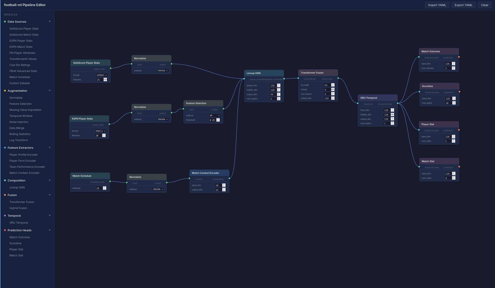

# Football ML

A modular machine learning pipeline for predicting football match statistics and outcomes. Built for experimentation — components can be swapped, reconfigured, and extended independently.

## Pipeline Editor


## Setup

Requires Python 3.12+.

```bash
python3 -m venv .venv
source .venv/bin/activate
pip install -e ".[dev]"
```

## Usage

```python
from football_ml.config import load_config
from football_ml.pipeline import FootballPipeline

config = load_config("configs/default.yaml")
pipeline = FootballPipeline(config, head="match_outcome")
```

Pipeline configuration is driven by YAML files — see [`configs/default.yaml`](configs/default.yaml) for the full set of options.

## Testing

```bash
# Run all tests
pytest

# Run by category
pytest -m smoke          # Forward pass sanity checks for every module
pytest -m integration    # Multi-module combination tests
pytest tests/unit/       # Config loading, base class contracts
```
